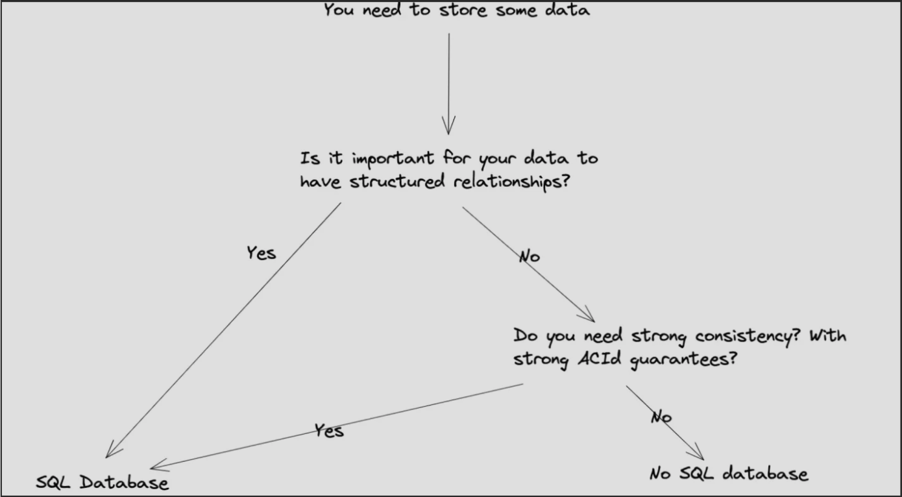

# Databases

Note: most of the data here will come from [this](https://interviewing.io/guides/system-design-interview/part-two) guide

## SQL vs NoSQL

| SQL Pros                                           | SQL Cons                                              |
| -------------------------------------------------- | ----------------------------------------------------- |
| Structured data                                    | Horizontal scaling is complex                         |
| Can handle complex queries                         | Changing schema can be difficult/disruptive           |
| Guarantees ACID                                    | Performance can suffer under heavy load               |
| Has many mature tools                              | Slower to write to due to how data is stored          |
| Customer using service always sees up-to-date info | Strong consistency is expensive to reduce latency for |

| NoSQL Pros                             | NoSQL Cons                  |
| -------------------------------------- | --------------------------- |
| Scalability                            | Data consistency is complex |
| It's schema-less so it's very flexible | Limited query capabilities  |
| High performance for specific queries  | It's less mature            |
| Can handle large volumes of data       |                             |

Data consistency in NoSQL can stem from the fact that NoSQL has no fixed schema.

## How to pick a a database



## What is ACID?

Imagine you're going to buy a ticket for a concert on TicketMaster. When you go to buy this ticket, several things need to happen in order for the purchase to be succesful:

1. You choose the seat you want
2. You provide your payment information
3. The system will check if that seat is still available and if your payment info is valid
4. The payment gets prrocessed
5. Congrats, you just got your $1200 tickets to see Taylor Swift.

SQL compared to NoSQL has a much stronger ACID guarantee right out of the box. Wat does this mean?

Well let's break down ACID.

**A**tomicity - everything needs to happen or nothing happens. if one part in the above 5 steps fails, then everything that has been done so far fails

**C**onsistency - everything must stay correct. transactions in a database must follow all of the rules, so your payment info must be valid and there must be a product in stock

**I**solation - as you go to buy a ticket, your purchase doesn't affect another person's purchase. each of these transactions must remain independent

**D**uralibility - these changes have to stick. once the payment has been confirmed and your card is charged, it cannot be undone.

### "Hold up" I say in my best Nate Dogg voice

What happens if there is only one ticket left and someone else tries to purchase it at the same time as you? We can use concurrency here.

There are two specific mechanisms that can be used, isolation levels and locking.

- Locking refers to a technique where the database prevents other transactions from accessing the same data at the same time. There are several types of locks so let's focus on two for now:
  - Exclusive locks: these prevent other transactions from reading or writing the locked data. if a transaction holds an exclusive lock on a record, no other transaction can check or change it until the lock is released
  - Shared locks: these locks allow multiple transactions to read data but not write to it.
- Isolation levels: SQL databases offer different levels of isolation which will dictate how transaction data is isolated from or visible to other transactions.
  - Read uncommitted: allows transactions to see changes made by other transactions even if they haven't been committed (can lead to dirty reads)
  - Read committed: ensures a transaction can only read data that has been committed before the transaction begn. Will prevent dirty reads
  - Repeatable read: ensures that if a transaction reads data, it can read that same data again and see the same values. Could still encounter phantom reads
  - Serializable: highest level of isolation. ensures complete isolation from other transactions, making the transaction appear as if it's the only one interacting with the database.

For the most part, the database management systems will implement these. Database admins or system admins configure the DBMS to use specific locking mechanisms and isolation levels based on the requirements of the application. The DBMS will manage concurrency control internally using algorithms and mechanisms such as locking, timestamp ordering, or multi version concurrency control. However, developers can also specify the desired isolation level for their transactions using SQL commands:

1. set transaction isolation level

```SQL
SET TRANSACTION ISOLATION LEVEL { READ UNCOMMITTED | READ COMMITTED | REPEATABLE READ | SERIALIZABLE };
```

For example:

```SQL
SET TRANSACTION ISOLATION LEVEL READ COMMITTED;
```

2. begin transaction

```SQL
BEGIN TRANSACTION;
```

3. execute your sql statement

4. `COMMIT` if you want to save the transaction to the database or `ROLLBACK` if you want to discard it

Commit:

```SQL
COMMIT;
```

Rollback:

```SQL
ROLLBACK;
```
