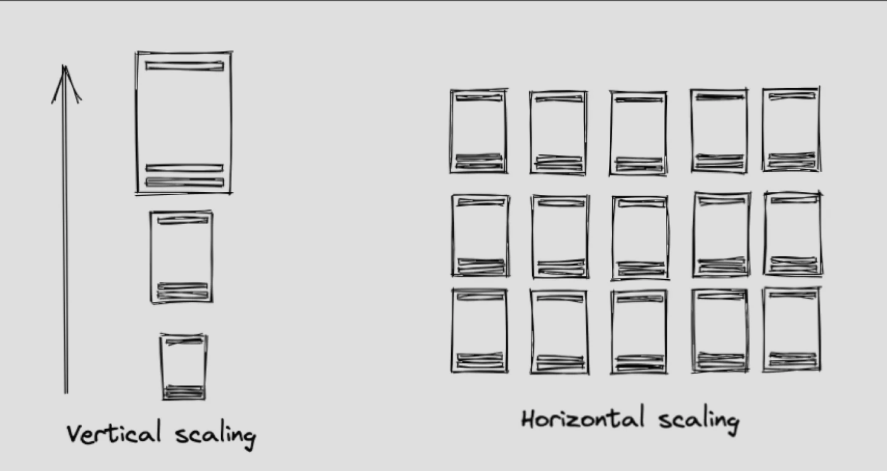

# Scaling

## Vertical scaling

To scale vertically, you make your current computer more powerful. This may be the easiest as you don't have to change your software architecture. There's also less latency since communication between different parts of your software is done locally on one computer rather than through a network.

Disadvantages:

- physical hardware limitations can lead to a very expensive or impossible upgrade.
- risk of the single system failing

## Horizontal scaling

To scale horizontally, you buy or rent more computers and distribute the load among the computer. There are two major forms: database and compute scaling. We can also use this with caching.

### Database scaling

This refers to the process of making your database system capable of handling increasing amounts of data, traffic, or workload as your application grows. This ensures that your database remains responsive, reliable, and performs well under heavy load.

Imagine you're starting a library and you start out with one bookshelf. As your collection grows, you get more bookshelves (servers) to accommodate the increasing number of books. Each bookshelf can hold a portion of the collection which spreads out the load and makes it easier to find books.

#### Sharding

In a regular setup, you could have a Users, Books, and Music table all on one single server (this could be physical or cloud server). This setup has no partitioning.

In a sharded setup, we divide the Users, Books, and Music tables into seperate sections. We do this with a "sharding key" which is whaat we use to determine how we'll divide the data across shards. This could be based on specific attributes (think user id, book id, music genere).

Instead of having separate databases for each of these tables, the table themselves are sharded across multiple servers. This helps balance the load evenly across these two shards

### Compute scaling
